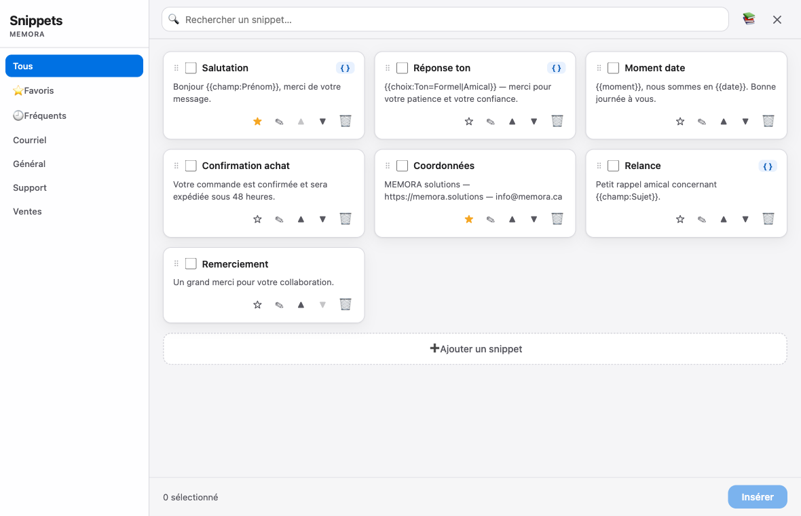

# MEMORA — Macros pour Keyboard Maestro

> Auteur : **MEMORA solutions** — https://memora.solutions — info@memora.ca · Licence **Apache-2.0**

Deux outils macOS propulsés par **Keyboard Maestro**, pensés pour être installés **en un double-clic**, même par un débutant. Ils transforment vos textes répétitifs en macros autonomes et puissantes, sans jamais ouvrir l'éditeur de Keyboard Maestro.



---

## Ce que ça fait

### 1. MEMORA — Snippets &nbsp;·&nbsp; `;mem`

Une fenêtre élégante pour **insérer vos textes réutilisables** dans n'importe quelle application macOS.

- Tapez **`;mem`** → la fenêtre s'ouvre.
- **Cochez** un ou plusieurs snippets, cliquez **Insérer** (ou appuyez sur **Entrée**) → le texte est collé instantanément dans l'app active.
- **Variables dynamiques** : à l'insertion, une petite fenêtre vous demande les valeurs manquantes (avec aperçu en direct).
- **Panneau de variables** : cliquez ou **glissez-déposez** un bouton dans le texte pour insérer le bon jeton — pas besoin de mémoriser la syntaxe.
- **Recherche** instantanée (floue, tolérante aux fautes) ; badge `{ }` sur les snippets à variables.
- **Favoris ⭐**, vue **Fréquents**, **dossiers** et barre latérale de catégories.
- **Gestion complète dans la fenêtre** : ➕ ajouter · ✎ modifier · 🗑 supprimer · glisser-déposer pour réordonner.
- **Profil 👤** : renseignez vos infos une seule fois (prénom, courriel, entreprise…) → réutilisées partout via `{{moi:…}}`.
- **Assistant IA (OpenRouter)** : reformuler · traduire · corriger · raccourcir votre texte, avec aperçu avant insertion. Vous saisissez **votre propre clé** (via 👤) ; elle reste sur votre Mac.
- **Import / Export JSON** (📚) : sauvegardez, migrez ou partagez votre bibliothèque.
- Mode sombre automatique, fenêtre adaptée à votre écran, accessible (WCAG 2.2).

---

### 2. MEMORA — Atelier &nbsp;·&nbsp; `;atelier`

Créez de **vraies macros Keyboard Maestro indépendantes**, facilement, sans toucher à l'éditeur.

> « La facilité de TypeDesk, la puissance de Keyboard Maestro. »

- Tapez **`;atelier`** → la fenêtre s'ouvre.
- Donnez un **nom** à votre macro.
- Choisissez un **déclencheur** : une **chaîne tapée** (ex. `;courriel`) ET/OU un **raccourci clavier** (ex. ⇧⌘E, capturé directement dans la fenêtre). Au moins l'un des deux est requis.
- Rédigez votre **texte** en utilisant le même panneau de variables que Snippets.
- Cliquez **Créer** → la macro autonome est ajoutée dans le groupe **« Mes textes MEMORA »** de Keyboard Maestro. Elle fonctionne immédiatement, dans toutes vos apps.
- **Macros à variables** : à chaque déclenchement, une petite fenêtre de remplissage s'ouvre, demande les valeurs et insère le texte complété.
- **Gérez vos macros** depuis l'Atelier : **✎ Ouvrir dans Keyboard Maestro** (pour aller plus loin) · **🗑 Supprimer** (avec confirmation, sans popup bloquant).

---

## Installation (double-clic — débutant)

Prérequis : macOS avec **Keyboard Maestro 11+** installé.

### MEMORA — Snippets

1. **[Télécharger la dernière version](../../releases/latest)** → fichier `MEMORA-Snippets-vX.Y.kmmacros`.
2. **Double-cliquez** le fichier téléchargé → Keyboard Maestro l'importe automatiquement.
3. Dans n'importe quelle app, tapez **`;mem`** → la fenêtre s'ouvre.

### MEMORA — Atelier

1. **[Télécharger la dernière version](../../releases/latest)** → fichier `MEMORA-Atelier-vX.Y.kmmacros`.
2. **Double-cliquez** le fichier téléchargé → Keyboard Maestro l'importe automatiquement.
3. Tapez **`;atelier`** → la fenêtre s'ouvre.

> Les deux outils peuvent être installés ensemble ; ils fonctionnent de façon indépendante.

---

## Utilisation

### MEMORA — Snippets (`;mem`)

| Action | Comment |
|--------|---------|
| Ouvrir la fenêtre | Tapez **`;mem`** dans n'importe quelle app |
| Insérer un snippet | Cochez-le, puis cliquez **Insérer** ou appuyez sur **Entrée** |
| Ajouter un snippet | Bouton **➕** dans la fenêtre |
| Modifier un snippet | Bouton **✎** sur la carte |
| Supprimer | Bouton **🗑** (suppression annulable) |
| Réordonner | Glisser-déposer par la poignée ⠿ |
| Filtrer | Barre latérale : Tous · ⭐ Favoris · 🕘 Fréquents · dossiers |
| Éditer le profil | Bouton **👤** |

### MEMORA — Atelier (`;atelier`)

| Action | Comment |
|--------|---------|
| Ouvrir la fenêtre | Tapez **`;atelier`** dans n'importe quelle app |
| Créer une macro | Remplissez Nom + Déclencheur + Texte, puis **Créer** |
| Ouvrir dans KM | Bouton **✎** dans la liste des macros créées |
| Supprimer une macro | Bouton **🗑** (confirmation intégrée) |

> **Taille de la fenêtre** : les fenêtres `;mem` et `;atelier` s'ouvrent adaptées à votre écran et sont **redimensionnables à la souris** (tirez un coin ou un bord). *(Si une ancienne installation ne l'est pas encore : ré-importez la dernière version, ou cochez **Resizable** dans le menu engrenage ⚙ de l'action « Custom HTML Prompt » de la macro.)*

---

## Variables — tableau des jetons

Ces jetons s'insèrent en cliquant un bouton dans le panneau de variables (ou en les tapant directement dans le texte).

| Jeton | Ce qu'il insère |
|-------|----------------|
| `{{champ:Étiquette}}` | Champ texte libre demandé à l'insertion |
| `{{choix:Étiquette=A\|B\|C}}` | Menu déroulant demandé à l'insertion |
| `{{date}}` | Mois + année courants (ex. « juin 2026 ») |
| `{{date:complet}}` | Date complète (ex. « vendredi 12 juin 2026 ») |
| `{{date:court}}` | Date courte (ex. « 12/06/2026 ») |
| `{{date:jour}}` | Numéro du jour (ex. « 12 ») |
| `{{date:iso}}` | Format ISO (ex. « 2026-06-12 ») |
| `{{datechoix:Étiquette}}` | Sélecteur de date (calendrier) demandé à l'insertion |
| `{{moment}}` | « Matin », « Après-midi » ou « Soir » selon l'heure |
| `{{alea:A\|B\|C}}` | Une valeur au hasard parmi la liste |
| `{{moi:prénom}}` | Valeur du profil (prénom, nom, courriel, téléphone, entreprise, rôle, site) |
| `{{presse-papier}}` | Contenu actuel du presse-papier |

> Boutons Civilité dans le panneau → insèrent « Madame » ou « Monsieur » selon la sélection.

---

## Assistant IA (OpenRouter)

L'éditeur de snippet inclut un assistant IA (Reformuler, Traduire, Corriger, Raccourcir, Allonger, ou instruction libre) avec aperçu avant insertion.

1. Créez un compte et une clé sur **[openrouter.ai](https://openrouter.ai)**.
2. Dans `;mem`, ouvrez **👤 Profil** et collez votre **clé OpenRouter** (et, au besoin, un **modèle**, ex. `openai/gpt-4o-mini`).
3. Dans l'édition d'un snippet, utilisez la section **✨ IA**.

### Choix du modèle

Vous pouvez utiliser **n'importe quel modèle** OpenRouter (réglé via **👤 Profil**) : un modèle **payant** (ex. `openai/gpt-4o-mini`) ou un modèle **gratuit** (suffixe `:free`, ex. `google/gemma-4-31b-it:free`). La liste à jour est sur **[openrouter.ai/models](https://openrouter.ai/models)**.

### Limites des modèles gratuits

Les modèles gratuits d'OpenRouter sont soumis à des **limites de débit** : un plafond **par minute** (quelques dizaines de requêtes) et un plafond **quotidien** propre à votre compte. C'est normal et géré côté OpenRouter (détails sur **[openrouter.ai/docs](https://openrouter.ai/docs)**).

Quand vous atteignez la limite d'un modèle gratuit, l'assistant **ne plante pas** : il affiche un message clair, en rouge, dans la section **✨ IA** —

> **Limite du modèle GRATUIT atteinte. Réessayez plus tard, ou choisissez un autre modèle (réglages via Profil).**

**Que faire :**
- **Patientez** un court instant (le plafond par minute se réinitialise vite), puis réessayez ; ou
- **Changez de modèle** dans **👤 Profil** — un autre modèle gratuit, ou un modèle payant très bon marché (ex. `openai/gpt-4o-mini`) pour ne plus être limité.

### Messages de l'assistant IA

L'assistant traduit chaque cas en message clair (jamais de code d'erreur brut, jamais de fenêtre bloquante) :

| Situation | Ce que l'assistant affiche |
|-----------|----------------------------|
| Limite d'un modèle **gratuit** atteinte | « Limite du modèle GRATUIT atteinte. Réessayez plus tard, ou choisissez un autre modèle (réglages via Profil). » |
| Trop de requêtes (modèle payant) | « Trop de requêtes (limite de débit). Patientez un instant et réessayez. » |
| Crédits OpenRouter insuffisants | « Crédits OpenRouter insuffisants pour ce modèle. Ajoutez des crédits, ou utilisez un modèle gratuit (suffixe `:free`). » |
| Clé invalide ou non autorisée | « Clé OpenRouter invalide ou non autorisée. Vérifiez votre clé dans le Profil. » |
| Nom de modèle erroné | « Modèle introuvable : vérifiez le nom du modèle dans le Profil. » |
| Clé absente | « clé OpenRouter manquante (réglez-la via le bouton Profil) » |

> *Comportement vérifié avec de vrais appels OpenRouter — modèle payant et modèle gratuit, dont un véritable dépassement de limite (HTTP 429).*

> **Confidentialité** : votre clé reste **locale à votre Mac** (variable Keyboard Maestro `memora_or_key`), n'est **jamais incluse dans ce dépôt** ni partagée. L'appel réseau est fait par une action Keyboard Maestro « Execute Shell Script » (la clé n'apparaît pas dans la fenêtre).

---

## Pour utilisateurs avancés

Le code source de chaque fenêtre est disponible dans le dossier `templates/` :

| Fichier | Description |
|---------|-------------|
| `templates/memora-snippets.template.html` | Fenêtre MEMORA — Snippets (HTML/CSS/JS, sans dépendance) |
| `templates/memora-atelier.template.html` | Fenêtre MEMORA — Atelier |
| `templates/memora-fill.template.html` | Fenêtre de remplissage des variables (partagée par les deux outils) |

Chaque fichier s'intègre dans une action **« Custom HTML Prompt »** de Keyboard Maestro. Vous pouvez les adapter librement selon la licence Apache-2.0 (voir ci-dessous).

Structure type d'une macro Snippets :
```
Set Variable memora_texte = ""
→ Custom HTML Prompt (memora-snippets.template.html)
→ Insert Text by Pasting %Variable%memora_texte%
```

Les snippets sont stockés en JSON dans la variable Keyboard Maestro `memora_snippets` :
```json
[{ "terme": "Titre du snippet", "texte": "Contenu…", "coche": false }]
```

---

## Contenu du dépôt

```
macros/
  MEMORA-Snippets.kmmacros     Installation en 1 double-clic — outil Snippets
  MEMORA-Atelier.kmmacros      Installation en 1 double-clic — outil Atelier

templates/
  memora-snippets.template.html   Code source de la fenêtre Snippets
  memora-atelier.template.html    Code source de la fenêtre Atelier
  memora-fill.template.html       Code source de la fenêtre de remplissage

docs/
  apercu.png                   Capture d'écran

CHANGELOG.md                   Historique des versions
LICENSE                        Texte de la licence Apache-2.0
NOTICE                         Avis d'attribution obligatoire
```

---

## Licence

**Apache License 2.0** — voir [LICENSE](LICENSE) et [NOTICE](NOTICE).

Open source : utilisez, modifiez et redistribuez librement, **à condition de conserver l'attribution à MEMORA solutions** (notices de copyright + contenu du fichier `NOTICE`) dans toute redistribution ou œuvre dérivée (Apache-2.0, art. 4).

En clair : libre d'utilisation, mais le crédit **MEMORA solutions** reste obligatoire.

---

Fait avec soin par **MEMORA solutions** — https://memora.solutions — info@memora.ca
